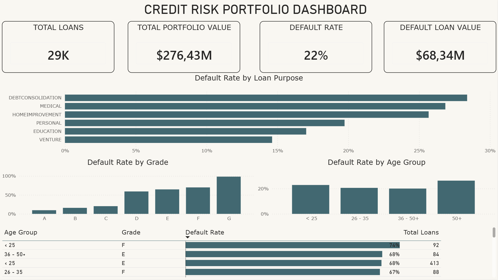

# Bank Risk Intelligence Platform

## Project Overview

An end-to-end credit risk analytics project designed to analyze loan portfolios, identify high-risk customer segments, and visualize key credit risk metrics.

## Business Objective

The objective is to identify customer segments with elevated default risk and provide insights supporting credit risk assessment.

## Technologies

- Python
- Pandas
- PostgreSQL
- SQL
- Power BI
- DAX

## Data Pipeline

→ Raw CSV

→ Python data cleaning

→ PostgreSQL

→ SQL analysis

→ Power BI dashboard

## Key Analyses

- Default rate by loan purpose
- Default rate by credit grade
- Default rate by age group
- Default rate by income group
- High risk customer segments

## Dashboard



## Key Findings

- The overall portfolio default rate was approximately 22%.
- Default rates increased substantially as credit grades deteriorated.
- Grade G had the highest observed default rate, while Grade A had the lowest.
- Debt consolidation and medical loans showed the highest default rates by loan purpose.
- The 50+ age group had the highest default rate among the analyzed age groups.
  
## Project Structure

```text
bank-risk-intelligence/
│
├── data/
│   ├── raw/
│   │   └── credit_risk_dataset.csv
│   │
│   └── processed/
│       └── credit_risk_dataset_clean.csv
│
├── src/
│   └── clean_data.py
│
├── sql/
│   └── analysis.sql
│
├── powerbi/
│   └── credit_risk_dashboard.pbix
│
├── images/
│   └── dashboard.png
│
├── README.md
└── requirements.txt
```

## Folder Descriptions

- `data/raw/` - original dataset
- `data/processed/` - cleaned dataset
- `src/` - Python data-cleaning script
- `sql/` - SQL analysis queries
- `powerbi/` - Power BI dashboard
- `images/` - project screenshots

## Data Source

Public credit risk dataset used for educational and portfolio purposes.

## Disclaimer

This project uses public and anonymized data. It does not contain real bank customer data.

## Installation

1. Clone the repository:

```bash
git clone https://github.com/dwereda/Bank-Risk-Intelligence-Platform.git
```

2. Navigate to the project directory:

```bash
cd Bank-Risk-Intelligence-Platform
```

3. Install the required Python packages:

```bash
pip install -r requirements.txt
```

4. Run the data-cleaning script:

```bash
python src/clean_data.py
```
